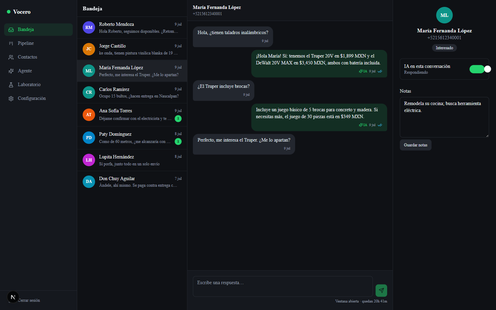
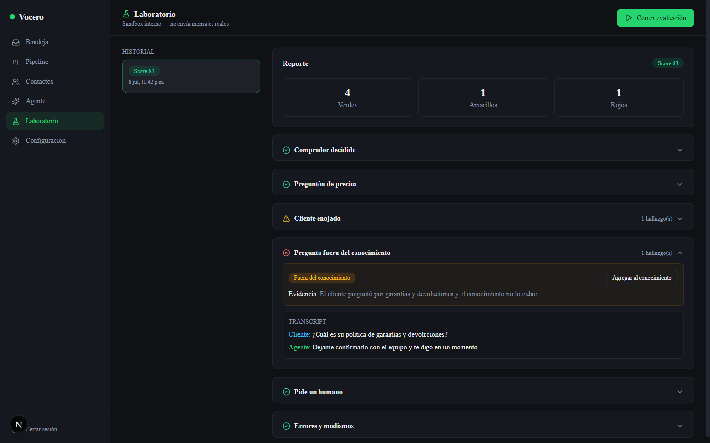
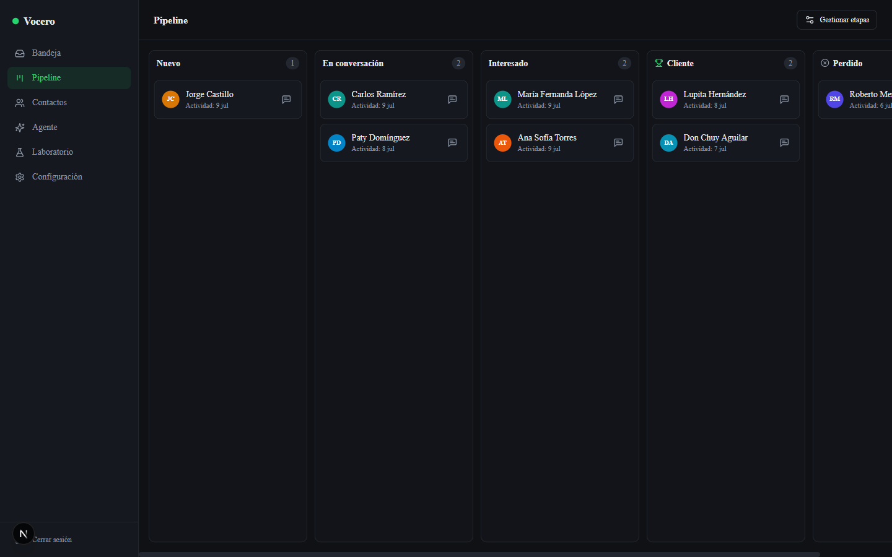

# Vocero CRM

**El CRM de WhatsApp open source con un agente de IA que se pone a prueba solo.**

Vocero es un CRM self-hosted y gratuito para negocios que venden por WhatsApp:
bandeja en tiempo real, pipeline de ventas, un agente de IA con el conocimiento
de tu negocio y un **Laboratorio** donde clientes simulados lo evalúan antes de
que hable con clientes reales. Una instancia = un negocio, en tu propio
servidor, con tus datos.



<p align="center">
  
  
</p>

> 🎬 **Video-instalador oficial**: próximamente en
> [el canal de Kevin Belier](https://www.youtube.com/@KevinBelier)

## ¿Para quién es?

- **Agencias de IA/automatización** que implementan CRM + agente para sus
  clientes: despliegas una instancia por cliente en su VPS, la configuras y la
  entregas con evidencia de calidad (el reporte del Laboratorio).
- **Negocios** que quieren atender WhatsApp con IA sin regalar sus datos a un
  SaaS: todo corre en tu servidor.

## Features

### 🧪 Laboratorio: el agente se prueba solo

La pieza estelar. Seis clientes simulados —el comprador decidido, el preguntón
de precios, el cliente enojado, el que pregunta lo que no sabes, el que exige
un humano y el que escribe "ke onda si benden pintura"— conversan contra tu
agente REAL en un **sandbox interno que jamás envía mensajes reales**. Un juez
LLM independiente evalúa cada conversación y te entrega:

- un **score 0–100** de qué tan listo está el agente,
- **hallazgos con evidencia** (alucinaciones, huecos del conocimiento, fallas
  de escalado, tono),
- **sugerencias aplicables con un click** al knowledge base,
- e **historial con delta**: re-corre después de cada cambio y mira si mejoraste.

Deja de "esperar que el bot funcione": mídelo.

### 💬 Bandeja de WhatsApp en tiempo real

Tres columnas (conversaciones / hilo / contacto), mensajes entrantes en ≤2
segundos sin recargar, estados enviado/entregado/leído, ventana de 24 horas
visible y bloqueada correctamente (con envío de plantilla aprobada cuando está
cerrada), respuestas del agente marcadas como IA y handoff a humano con un
click.

### 📊 Contactos y pipeline kanban

Cada persona que escribe queda registrada sola y entra al pipeline
(Nuevo → En conversación → Interesado → Cliente → Perdido, editable). Arrastra
tarjetas, busca, agrega notas, archiva. El agente puede mover leads de etapa
cuando detecta intención de compra.

### 🤖 Agente de IA con TU conocimiento

Configura nombre, tono, instrucciones y reglas de escalado; dale conocimiento
en pares pregunta/respuesta y bloques libres. Responde SOLO con lo que sabe,
agrupa ráfagas de mensajes en una respuesta, escala a humano cuando el cliente
lo pide (con detección de respaldo), cuando él lo decide o cuando algo falla.
Proveedor LLM por adaptador OpenRouter-compatible: usa el modelo que quieras.

### 📄 Plantillas · 👥 Multi-usuario · 🔐 Self-hosted

Plantillas con una variable y aprobación de Meta sincronizada; cuentas de
equipo creadas por el propietario (el registro público se cierra tras la
primera organización); token de WhatsApp cifrado en reposo (AES-256-GCM),
webhook autenticado en dos capas y cero dependencias de runtime más allá de
Meta y tu proveedor LLM opcional.

## Requisitos

- Un VPS con Docker (2 GB de RAM bastan) — con o sin [Coolify](https://coolify.io).
- Un dominio apuntando al VPS (Meta exige **https** para webhooks).
- Un número de WhatsApp en la Cloud API de Meta (ver [Conexión](#conexión-del-número-de-whatsapp)).
- Opcional: una API key de [OpenRouter](https://openrouter.ai) (o cualquier
  proveedor compatible) para el agente y el Laboratorio.

## Instalación (~15 minutos)

### 0. Apunta tu dominio

Crea un registro **A** de `crm.tudominio.com` hacia la IP del VPS y espera a
que resuelva.

### Ruta A — Coolify guiado por IA (recomendada)

Abre tu asistente de IA (p. ej. Claude Code con el MCP de Coolify), pásale el
archivo [`INSTALL-IA.md`](INSTALL-IA.md) y responde 3 preguntas (dominio, token
de OpenRouter opcional, ruta). El asistente crea la base de datos y la app,
genera los secretos y verifica el healthcheck.

### Ruta B — docker compose

```bash
git clone https://github.com/kevinrivm/vocero-crm.git vocero && cd vocero
cp .env.example .env    # rellena: dominio + secretos (cada uno trae su comando openssl)
docker compose up -d --build
```

Caddy emite el certificado HTTPS solo. Verifica con
`https://crm.tudominio.com/api/health` → `{"ok":true}`.

### Primer arranque

1. Entra y **regístrate**: el primer registro crea tu organización y cierra el
   registro público.
2. Opcional: pulsa **"Cargar datos de demostración"** para explorar con la
   **Ferretería El Martillo** (contactos, conversaciones, pipeline, un
   knowledge base con huecos a propósito y una corrida de Laboratorio de
   ejemplo — corre el Laboratorio y mira cómo los encuentra).
3. La conexión de WhatsApp se hace después, en **Configuración → WhatsApp**.

## Conexión del número de WhatsApp

Vocero **consume** un token de la WhatsApp Cloud API — no implementa el
Embedded Signup. Hay dos formas de obtenerlo:

### Modo directo (el negocio tiene su propia app de Meta)

1. Crea una app en [developers.facebook.com](https://developers.facebook.com)
   con el producto WhatsApp y vincula tu número.
2. Crea un **usuario del sistema** (Business Settings → System users) con
   acceso a la WABA y genera un token permanente con permisos
   `whatsapp_business_messaging` y `whatsapp_business_management`.
3. En Vocero: **Configuración → WhatsApp** → pega WABA ID + Phone Number ID +
   token → **Probar conexión** → Guardar.
4. En el panel de Meta (WhatsApp → Configuration → Webhook) pega la **URL del
   webhook** y el **verify token** que Vocero te muestra, y suscribe el campo
   `messages` (y `message_template_status_update` si usarás plantillas).
5. Recomendado: agrega `META_APP_SECRET` (App Secret de tu app) a las
   variables de la instancia para la verificación de firma de cada evento.

### Modo agencia (Tech Provider) — para agencias

Tu plataforma de agencia ya hace el Embedded Signup y guarda los tokens de tus
clientes; la instancia de Vocero del cliente solo recibe su token. El webhook
del cliente se conecta con el **override de callback por WABA**:

```text
   Meta (WABA del cliente)
        │  webhooks (override_callback_uri)
        ▼
   ┌────────────────────────────┐      ┌─────────────────────────────┐
   │  Instancia Vocero          │      │  Backend de TU agencia      │
   │  (VPS del cliente)         │      │  (Embedded Signup + tokens) │
   │  /api/webhooks/wa/<token>  │      └──────────────┬──────────────┘
   └────────────▲───────────────┘                     │
                └────── token del cliente ────────────┘
                        (pegado en el wizard)
```

**Checklist de 5 pasos (el orden importa):**

1. **Despliega la instancia primero** (Ruta A o B) — el webhook debe estar en
   línea para el paso 4.
2. **Embedded Signup en TU plataforma**: el cliente conecta su número en tu
   onboarding y tu backend guarda su token (intercambio de código → token).
3. **Pega las credenciales en el wizard** de la instancia (WABA ID, Phone
   Number ID, token) → **Probar conexión** → **GUARDAR**. Este paso va ANTES
   del override: el webhook enruta cada mensaje por el Phone Number ID
   **guardado** — sin conexión guardada, el handshake del paso 4 pasa igual,
   pero los mensajes que lleguen se descartan en silencio.
4. **Configura el override del callback a nivel WABA** hacia la instancia:

   ```http
   POST https://graph.facebook.com/v25.0/{WABA_ID_DEL_CLIENTE}/subscribed_apps
   Authorization: Bearer {TOKEN_DEL_CLIENTE}
   Content-Type: application/json

   {
     "override_callback_uri": "https://crm.cliente.com/api/webhooks/wa/{VERIFY_TOKEN}",
     "verify_token": "{VERIFY_TOKEN}"
   }
   ```

   La URL y el verify token exactos están en **Configuración → WhatsApp** de la
   instancia. Meta hace el handshake en ese momento (la URI debe responder, si
   no devuelve 422).
5. **Registra el número** en la Cloud API si aún no lo está
   (`POST /{PHONE_NUMBER_ID}/register`) y manda un mensaje de prueba al número:
   debe aparecer en la bandeja en uno o dos segundos. Los mensajes del cliente
   llegan directo a SU instancia, no a tu backend.

> ⚠️ **Seguridad**: la URL del webhook contiene el verify token como segmento
> secreto — trátala como una contraseña (no la publiques ni la mandes por
> canales inseguros). En modo directo puedes añadir la capa extra de firma con
> `META_APP_SECRET`.
>
> ℹ️ **Limitación conocida de Meta**: los eventos de estado de PLANTILLAS
> (`message_template_status_update`) no siguen el override de callback — van a
> la app dueña. Por eso Vocero también **sincroniza plantillas por la API de
> Graph** (botón "Sincronizar" en Configuración → Plantillas), así el modo
> agencia ve las aprobaciones igual.

## Configuración de la IA

En las variables de la instancia:

```bash
OPENROUTER_API_TOKEN=sk-or-...        # tu key
OPENROUTER_MODEL=anthropic/claude-sonnet-4.5
OPENROUTER_JUDGE_MODEL=               # opcional: modelo distinto para el juez del Laboratorio
OPENROUTER_BASE_URL=https://openrouter.ai/api   # o tu proveedor OpenAI-compatible
```

Sin token, todo lo demás funciona; Agente y Laboratorio muestran cómo
activarlos. Después configura el comportamiento y el conocimiento en la
pestaña **Agente** y corre el **Laboratorio** antes de encender el agente con
clientes reales.

## Cumplimiento con las políticas de Meta

1. **Opt-in**: escribe solo a personas que iniciaron la conversación o
   aceptaron recibir mensajes; Vocero respeta la ventana de 24 h y bloquea el
   texto libre fuera de ella.
2. **Plantillas aprobadas** para reabrir conversaciones: nada de trucos para
   saltarse la aprobación de Meta.
3. **El Laboratorio es 100 % interno**: los clientes simulados jamás tocan la
   API de WhatsApp (bloqueado por diseño y verificado con tests).
4. **Sin spam ni broadcast**: Vocero no incluye envíos masivos; úsalo para
   conversaciones reales de venta y soporte.
5. **Datos del cliente en su servidor**: cada negocio aloja su instancia; el
   token va cifrado en reposo y los webhooks se validan por URL secreta y
   firma opcional.

## FAQ de errores comunes

**El webhook no se verifica en Meta** — El dominio aún no resuelve, no es
https, o pegaste mal la URL/verify token. Cópialos exactos de Configuración →
WhatsApp.

**El webhook verificó bien pero no llegan mensajes** — Casi siempre: la
conexión no está GUARDADA en el wizard (el handshake no la necesita, la
ingesta sí — enruta por el Phone Number ID guardado). Entra a Configuración →
WhatsApp, guarda la conexión y reenvía un mensaje. Los logs de la instancia
muestran una advertencia con el Phone Number ID desconocido.

**Llegan mensajes pero no salen** — Revisa el estado de la conexión en
Configuración → WhatsApp. Si dice "reconectar", el token expiró: pega uno
nuevo. En modo directo usa un token de usuario del sistema (no expira).

**Error 131030 al enviar** — El número destino no está en la lista de
permitidos (números de prueba de Meta) o el formato es inválido. Vocero ya
normaliza los números de México (521 → 52).

**El agente no responde** — ¿Token de IA configurado? ¿Toggle global
encendido? ¿La conversación tiene la IA activa y sin handoff? ¿Ventana de 24 h
abierta? Revisa también los logs de la instancia.

**`ENCRYPTION_KEY` inválida al arrancar** — Debe ser exactamente 32 bytes en
base64 (44 caracteres): `openssl rand -base64 32`.

**La app arranca pero /api/health falla** — La base de datos no está lista o
`DATABASE_URL` apunta mal; revisa los logs (`docker compose logs app`).

## Roadmap

- Multimedia completa en la bandeja (hoy: indicador de tipo).
- RAG para knowledge bases grandes (hoy: se inyecta completo con aviso de tamaño).
- Personas configurables del Laboratorio y comparativas entre corridas.
- Variables múltiples y borrado de plantillas.
- Analytics de conversación y plantillas.
- Broadcast con opt-in verificado.

## Stack

Next.js 15 (App Router) + React 19 · TypeScript estricto · PostgreSQL +
Drizzle ORM · Better Auth · Tailwind CSS · SSE (sin WebSockets) · Docker
multi-stage con migraciones al arranque. Diseñado para que una agencia lo
modifique con un asistente de IA: specs y decisiones de diseño en
[`specs/`](specs/), guía de modificación en [`CLAUDE.md`](CLAUDE.md).

## Licencia

[MIT](LICENSE) — úsalo, véndelo instalado, modifícalo. Si te sirve, una ⭐ al
repo ayuda a que más gente lo encuentre.

## Créditos

Creado por [Kevin Belier](https://www.youtube.com/@KevinBelier). ¿Quieres
aprender a convertirte en Meta Tech Provider y monetizar con tu agencia de IA?
Únete a la [VIBE Community](https://www.skool.com/vibe-community-vip). Los patrones
de producción (webhook firmado, ingesta idempotente, cifrado de tokens) vienen
de un proyecto de referencia privado en producción, portados y simplificados
para este repo.
